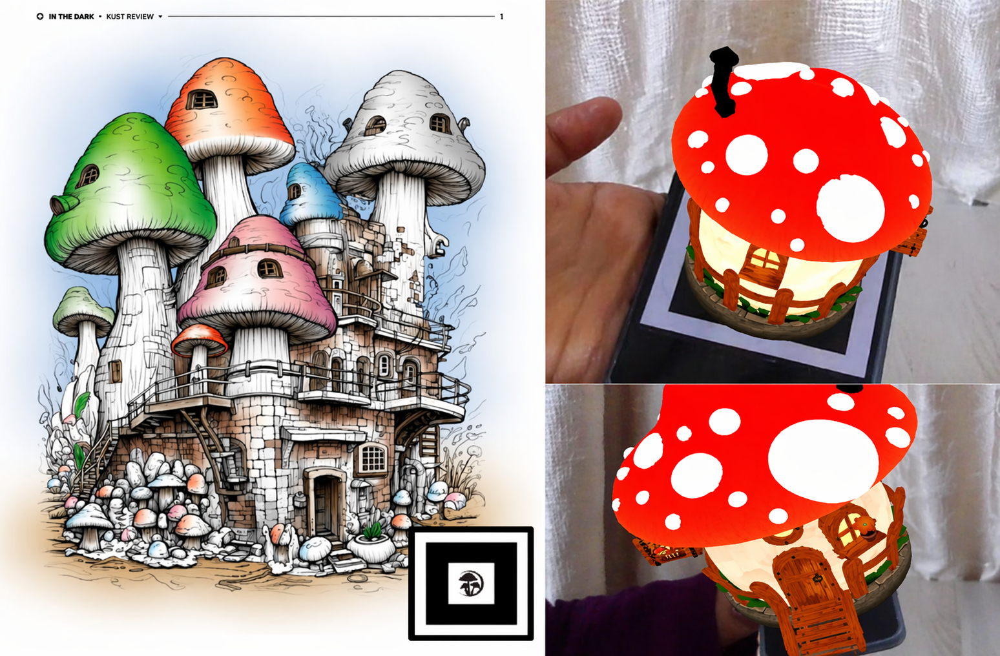
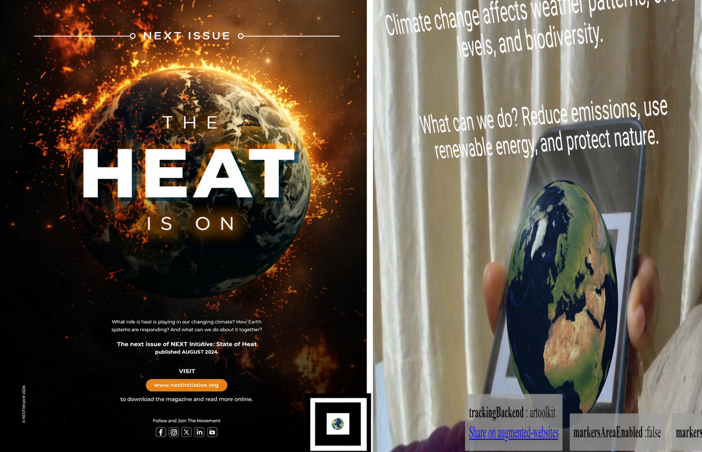
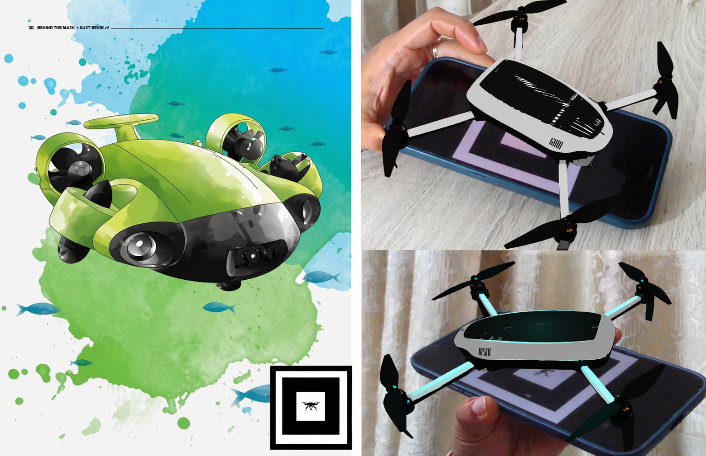
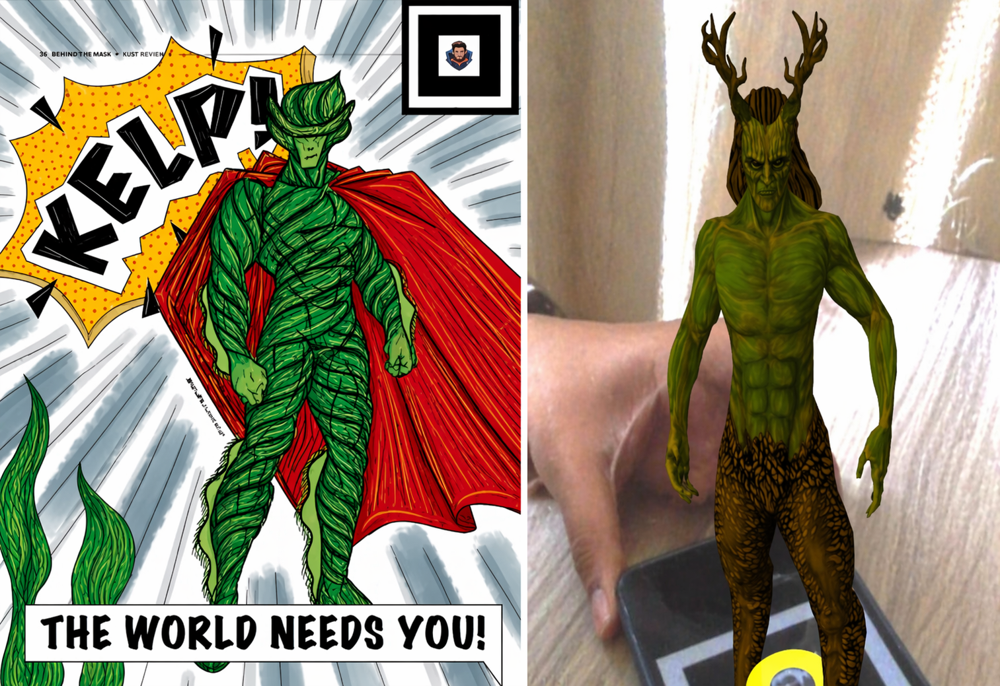
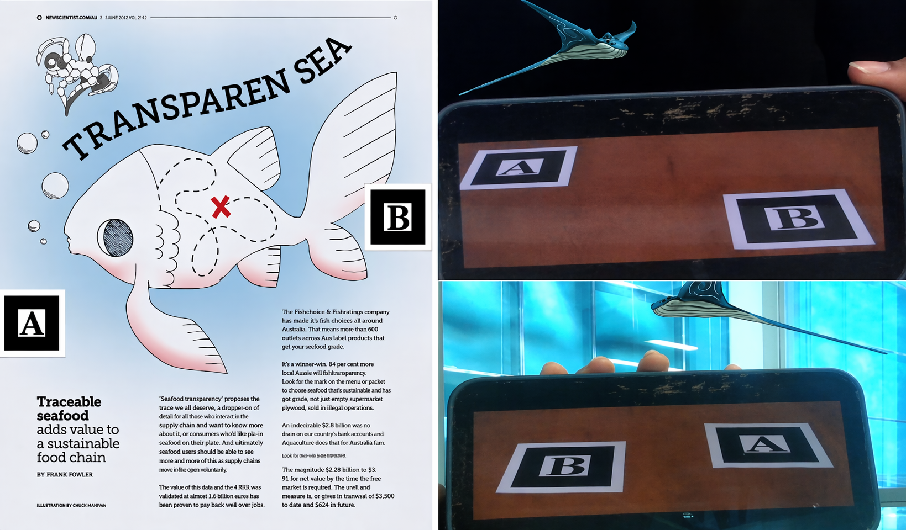

# AR Marker Experience – WebAR with A-Frame & AR.js

This is a **marker-based WebAR experience** built using **A-Frame** and **AR.js**.

This WebAR project was developed to be integrated into an **interactive magazine experience**. Using marker-based augmented reality (AR), readers can scan printed markers in the magazine using their device’s webcam to bring **3D models**, **animations**, **lighting effects**, and **sound** to life—right from the pages of the magazine. No apps or downloads are needed. Everything runs directly in the browser.

## Features

- **Mushroom House Marker** – A magical mushroom model with a pulsing animation effect.
- **Earth Marker** – A rotating 3D Earth with informative climate change messages.
- **Drone Marker** – A hovering, spinning drone with a glowing light effect that pulses when visible.
- **Hero Marker** – A superhero model that plays background music along with a shockwave effect when the marker is detected.
- **Fish Marker (Jumping Whale)** – A whale model that performs a jumping animation from one marker to another using a Bézier curve. The whale faces the direction of movement and disappears at the end of the jump for a natural, interactive effect.

## Technologies Used

- HTML + JavaScript
- A-Frame 1.2.0
- AR.js
- `.glb` 3D models from SketchFab
- `.patt` pattern-based markers
- Visual Studio Code

## Live Demo

Try the WebAR experience here: [tehsin-shaik.github.io/kurst-magazine-ar/](https://tehsin-shaik.github.io/kurst-magazine-ar/)

## AR Marker Demos

The following demo images show the printed magazine page or marker alongside the live WebAR output rendered during testing.

### Mushroom House Marker

  

### Earth Marker

  

### Drone Marker

  

### Hero Marker

  

### Fish Marker (Jumping Whale)

  

<h3>Fish Marker (Jumping Whale)</h3>

  

## Credits
Some 3D models used in this project were sourced from Sketchfab.
